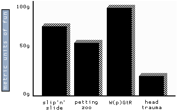

[<< index.html](index.html)

# Markdown example file

## h2

### h3

#### h4

##### h5

This is a paragraph

> This is a blockquote

    This is a code block

And another paragraph here\\
with a line break

Ready for a horizontal rule?

***

1. Order list item

* Unordered list item

* Nested list item
  1. first nested item

here's a definition list:

: definition here

Simple table:

| A simple | table |
| with multiple | lines |

More advanced table:

| Header 1 | Header 2 | Header 3 |
|:---------|:---------|:---------|
| value 1 | value 2 | value 3 |
|=====
| footer 1 | footer 2 | footer 3 |

Setting a class to a paragraph
{: .note }

A [link](http://kramdown.gettalong.org)
to the kramdown homepage.

Check out [DevDocs.io](http://devdocs.io/markdown/) for a full Markdown reference.

If you need a link to open in a new tab, just use inline html like <a href="https://github.com/adam-p/markdown-here/wiki/Markdown-Cheatsheet" target="_blank">this link</a> to a Markdown cheatsheet

An image:

Here is a *emphasized* word

Here is some __bold__ text

This is also **bold** text

Here is some __*bold emphasized*__ text

This is also ***bold emphasized*** text

This is a inline attribute.